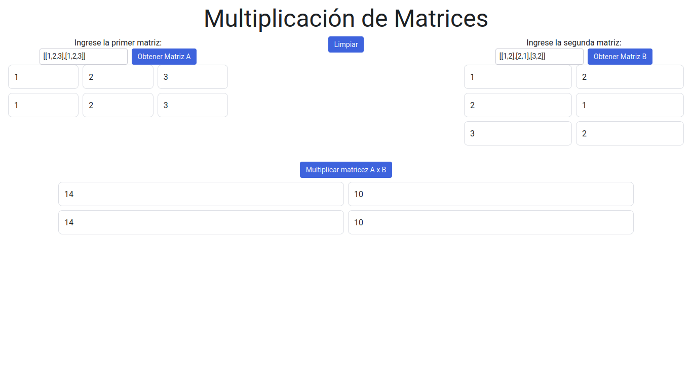

# Aplicación de multiplicación de matrices en Python con Reflex



La aplicación está desarrollada en Python con la biblioteca Reflex, que permite hacer páginas web con Python puro.

## Instalación
Para instalar la app, necesita bajar el zip de GitHub o usar `git clone https://github.com/matias101-blip/Multiplicacion-de-Matricez`

A continuación, debe crear un entorno virtual para Python con `venv` con el comando:
```bash
python -m venv "Nombre del entorno"
```
Ya creado el entorno, debemos activarlo:
### Linux
```bash
source "Nombre del entorno ya creado"/bin/activate
```
### Windows
```cmd
venv\Scripts\activate.bat
```

Ya activado el entorno, instalamos los requisitos con:
```bash
pip install -r requirements.txt
```
Ya instalados los requisitos, podemos inicializar la app con:
```bash
reflex run

#Salida
app running localhost:3000/
```
En su navegador, coloque la ruta que le da y pruebe la app.

## Uso
Al ingresar las matrices, iniciar con "[" para indicar que inicia la matriz.

Dentro de ahí, ingrese la primera columna "[1,2,3]". De esta forma decimos que la primera fila tendrá 3 columnas, de forma que tenemos "[[1,2,3]]". Fuera de la fila colocamos una coma seguida de otra "[]" para decir que esta es la siguiente fila, teniendo la siguiente matriz: [[1,2,3],[1,2,3]], obteniendo así una matriz de 2 x 3.

A continuación, le damos al botón de obtener matriz para que la matriz se grafique y esté lista en el backend. Repetimos el paso con la siguiente matriz.

Ya obtenidas las 2 matrices, procedemos a dar el botón de multiplicar y el resultado aparecerá abajo. En caso de que no cumpla la regla, se nos presentará un mensaje de error.

En caso de que aparezca un mensaje de error, verifique que las matrices estén bien escritas y cerradas.

Cualquier otro problema, notificarme con un issue.

Y disfrute la app.
